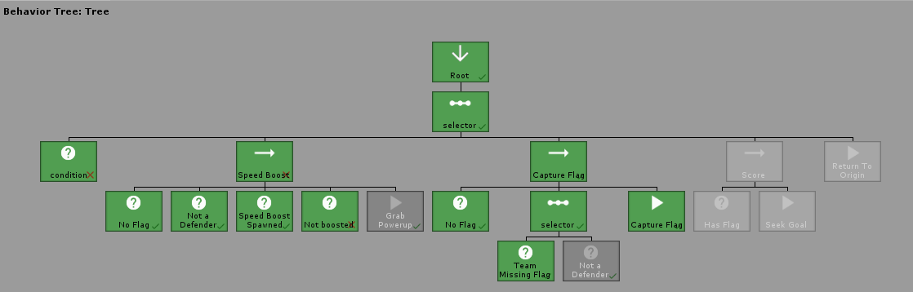

# Visual BT

Visual implementation of behavior trees for Unity projects. This is an increment of [fluid BT](https://github.com/ashblue/Visual-behavior-tree), with the added programmable GUI and some new nodes.

**Expected new features**

* Intuitive and programmable graphical interface, in the "drag-and-drop" style
* Node arguments editor, allowing access to exposed parameters of the tree node classes
* Real-time tree execution visualizer, for debbuging
* New Interrupt node
* Modified SelectorRandom node, making it actually random every time
* Shared variables declaration, creating a "global" memory for the tree

## Kanban de tarefas
[Acessível no Trello](https://trello.com/b/GKl44UAN/kanban-de-tarefas)

## Code driven use

When creating trees via code, you'll need to store them in a variable to properly cache all the necessary data.

```C#
using UnityEngine;
using CleverCrow.Fluid.BTs.Tasks;
using CleverCrow.Fluid.BTs.Trees;

public class MyCustomAi : MonoBehaviour {
    [SerializeField]
    private BehaviorTree _tree;
    
    private void Awake () {
        _tree = new BehaviorTreeBuilder(gameObject)
            .Sequence()
                .Condition("Custom Condition", () => {
                    return true;
                })
                .Do("Custom Action", () => {
                    return TaskStatus.Success;
                })
            .End()
            .Build();
    }

    private void Update () {
        // Update our tree every frame
        _tree.Tick();
    }
}
```

### What a Returned TaskStatus Does

Depending on what you return for a task status different things will happen.

* Success: Node has finished, next `tree.Tick()` will restart the tree if no other nodes to run
* Failure: Same as success, except informs that the node failed
* Continue: Rerun this node the next time `tree.Tick()` is called. A pointer reference is tracked by the tree and can only be cleared if `tree.Reset()` is called.

### Tree Visualizer

**THIS WILL BE OBSOLETE**

As long as your tree storage variable is set to `public` or has a `SerializeField` attribute. You'll be able to print a visualization of your tree while the game is running in the editor. Note that you cannot view trees while the game is not running. As the tree has to be built in order to be visualized.



### Extending Trees via code

You can safely add new code to your behavior trees with several lines. Allowing you to customize BTs while supporting future version upgrades. 

```c#
using UnityEngine;
using CleverCrow.Fluid.BTs.Tasks;
using CleverCrow.Fluid.BTs.Tasks.Actions;
using CleverCrow.Fluid.BTs.Trees;

public class CustomAction : ActionBase {
    protected override TaskStatus OnUpdate () {
        Debug.Log(Owner.name);
        return TaskStatus.Success;
    }
}

public static class BehaviorTreeBuilderExtensions {
    public static BehaviorTreeBuilder CustomAction (this BehaviorTreeBuilder builder, string name = "My Action") {
        return builder.AddNode(new CustomAction { Name = name });
    }
}

public class ExampleUsage : MonoBehaviour {
    public void Awake () {
        var bt = new BehaviorTreeBuilder(gameObject)
            .Sequence()
                .CustomAction()
            .End();
    }
}
```

### Installing

Visual Behavior Tree is used through [Unity's Package Manager](https://docs.unity3d.com/Manual/CustomPackages.html). In order to use it you'll need to add the following lines to your `Packages/manifest.json` file. After that you'll be able to visually control what specific version of Visual BT you're using from the package manager window in Unity. This has to be done so your Unity editor can connect to NPM's package registry.

```json
{
  "scopedRegistries": [
    {
      "name": "NPM",
      "url": "https://registry.npmjs.org",
      "scopes": [
        "com.fluid"
      ]
    }
  ],
  "dependencies": {
    "com.fluid.behavior-tree": "2.2.0"
  }
}
```

Archives of specific versions and release notes are available on the [releases page](https://github.com/ashblue/fluid-behavior-tree/releases).

### Example Scene

You might want to look at the [capture the flag](https://github.com/ashblue/fluid-behavior-tree-ctf-example) example project 
for a working example of how Visual Behavior Tree can be used in your project. It demonstrates real time usage
with units who attempt to capture the flag while grabbing power ups to try and gain the upper hand.

## Table of Contents

  * [Library](#library)
    + [Actions](#actions)
      - [Generic](#action-generic)
      - [Wait](#wait)
      - [Wait Time](#wait-time)
    + [Conditions](#conditions)
      - [Generic](#condition-generic)
      - [RandomChance](#randomchance)
    + [Composites](#composites)
      - [Sequence](#sequence)
      - [Selector](#selector)
      - [SelectorRandom](#selectorrandom)
      - [Parallel](#parallel)
    + [Decorators](#decorators)
      - [Generic](#decorator-generic)
      - [Inverter](#inverter)
      - [ReturnSuccess](#returnsuccess)
      - [ReturnFailure](#returnfailure)
      - [RepeatForever](#repeatforever)
      - [RepeatUntilFailure](#repeatuntilfailure)
      - [RepeatUntilSuccess](#repeatuntilsuccess)
  * [Creating Reusable Behavior Trees](#creating-reusable-behavior-trees)
  * [Creating Custom Reusable Nodes](#creating-custom-reusable-nodes)
    + [Your First Custom Node and Tree](#your-first-custom-node-and-extension)
    + [Custom Actions](#custom-actions)
    + [Custom Conditions](#custom-conditions)
    + [Custom Composites](#custom-composites)
    + [Custom Decorators](#custom-decorators)
  * [Nightly Builds](#nightly-builds)
  * [Development Environment](#development-environment)
    + [Submitting your own actions, conditions, ect](#making-commits)
    + [Pull Requests / Contributing](#pull-requests--contributing)
  * [Contributor Credits](#contributor-credits)

## Example Scene

You might want to look at the [capture the flag](https://github.com/ashblue/fluid-behavior-tree-ctf-example) example project 
for a working example of how Visual Behavior Tree can be used in your project. It demonstrates real time usage
with units who attempt to capture the flag while grabbing power ups to try and gain the upper hand.

## Library

Visual Behavior Tree comes with a robust library of pre-made actions, conditions, composites, and other nodes
to help speed up your development process.

### Actions

#### Action Generic

You can create a generic action on the fly. If you find yourself re-using the same actions you might want to
look into the section on writing your own custom actions.

```C#
.Sequence()
    .Do("Custom Action", () => {
        return TaskStatus.Success;
    })
.End()
```

#### Wait

Skip a number of ticks on the behavior tree.

```C#
.Sequence()
    // Wait for 1 tick on the tree before continuing
    .Wait(1)
    .Do(MyAction)
.End()
```

#### Wait Time

Waits until the passed number of seconds have expired in `deltaTime`.

```C#
.Sequence()
    .WaitTime(2.5f)
    .Do(MyAction)
.End()
```

### Conditions

#### Condition Generic

You can create a generic condition on the fly. If you find yourself re-using the same actions you might want to
look into the section on writing your own custom conditions.

```C#
.Sequence()
    .Condition("Custom Condtion", () => {
        return true;
    })
    .Do(MyAction)
.End()
```

#### RandomChance

Randomly evaluate a node as true or false based upon the passed chance.

```C#
.Sequence()
    // 50% chance this will return success
    .RandomChance(1, 2)
    .Do(MyAction)
.End()
```

### Composites

#### Sequence

Runs each child node in order and expects a *Success* status to tick the next node. If *Failure* is returned, the sequence will stop executing child nodes and return *Failure* to the parent.

**NOTE** It's important that every composite is followed by a `.End()` statement. This makes sure that your nodes
are properly nested when the tree is built.

```C#
.Sequence()
    .Do(() => { return TaskStatus.Success; })
    .Do(() => { return TaskStatus.Success; })
    
    // All tasks after this will not run and the sequence will exit
    .Do(() => { return TaskStatus.Failure; })

    .Do(() => { return TaskStatus.Success; })
.End()
```

#### Selector

Runs each child node until *Success* is returned.

```C#
.Selector()
    // Runs but fails
    .Do(() => { return TaskStatus.Failure; })

    // Will stop here since the node returns success
    .Do(() => { return TaskStatus.Success; })
    
    // Does not run
    .Do(() => { return TaskStatus.Success; })
.End()
```

#### SelectorRandom

Randomly selects a child node with a shuffle algorithm. Looks until `Success` is returned or every node fails. Shuffles every time the tree initially start running it.

```C#
.SelectorRandom()
    .Do(() => { return TaskStatus.Failure; })
    .Do(() => { return TaskStatus.Success; })
    .Do(() => { return TaskStatus.Failure; })
.End()
```

#### Parallel

Runs all child nodes at the same time until they all return *Success*. Exits and stops all running nodes if ANY of them return *Failure*.

```C#
.Parallel()
    // Both of these tasks will run every frame
    .Do(() => { return TaskStatus.Continue; })
    .Do(() => { return TaskStatus.Continue; })
.End()
```

### Decorators

Decorators are parent elements that wrap any node to change the return value (or execute special logic). They are
extremely powerful and a great compliment to actions, conditions, and composites.

#### Decorator Generic

You can wrap any node with your own custom decorator code. This allows you to customize re-usable functionality.

**NOTE**: You must manually call `Update()` on the child node or it will not fire. Also every decorator must be followed
by a `.End()` statement. Otherwise the tree will not build correctly.

```C#
.Sequence()
    .Decorator("Return Success", child => {
        child.Update();
        return TaskStatus.Success;
    })
        .Do(() => { return TaskStatus.Failure; })
    .End()
    .Do(() => { return TaskStatus.Success; })
.End()
```

#### Inverter

Reverse the returned status of the child node if it's `TaskStatus.Success` or `TaskStatus.Failure`. 
Does not change `TaskStatus.Continue`.

```C#
.Sequence()
    .Inverter()
        .Do(() => { return TaskStatus.Success; })
    .End()
.End()
```

#### ReturnSuccess

Return `TaskStatus.Success` if the child returns `TaskStatus.Failure`.
Does not change `TaskStatus.Continue`.

```C#
.Sequence()
    .ReturnSuccess()
        .Do(() => { return TaskStatus.Failure; })
    .End()
.End()
```

#### ReturnFailure

Return `TaskStatus.Failure` if the child returns `TaskStatus.Success`.
Does not change `TaskStatus.Continue`.

```C#
.Sequence()
    .ReturnFailure()
        .Do(() => { return TaskStatus.Success; })
    .End()
.End()
```

#### RepeatForever

Return `TaskStatus.Continue` regardless of what status the child returns. This decorator (and all descendent
tasks) can be interrupted by calling `BehaviorTree.Reset()`.

```C#
.Sequence()
    .RepeatForever()
        .Do(() => { return TaskStatus.Success; })
    .End()
.End()
```

#### RepeatUntilFailure

Return `TaskStatus.Failure` if the child returns `TaskStatus.Failure`, otherwise it returns `TaskStatus.Continue`.

```C#
.Sequence()
    .RepeatUntilFailure()
        .Do(() => { return TaskStatus.Success; })
    .End()
.End()
```

#### RepeatUntilSuccess

Return `TaskStatus.Success` if the child returns `TaskStatus.Success`, otherwise it returns `TaskStatus.Continue`.

```C#
.Sequence()
    .RepeatUntilSuccess()
        .Do(() => { return TaskStatus.Success; })
    .End()
.End()
```

## Creating Reusable Behavior Trees

Trees can be combined with just a few line of code. This allows you to create injectable behavior trees that bundles different
nodes for complex functionality such as searching or attacking.

Be warned that spliced trees require a newly built tree for injection, as nodes are only deep copied on `.Build()`.

```C#
using CleverCrow.Fluid.BTs.Trees;
using CleverCrow.Fluid.BTs.Tasks;
using UnityEngine;

public class MyCustomAi : MonoBehaviour {
    private BehaviorTree _tree;
    
    private void Awake () {
        var injectTree = new BehaviorTreeBuilder(gameObject)
            .Sequence()
                .Do("Custom Action", () => {
                    return TaskStatus.Success;
                })
            .End();

        _tree = new BehaviorTreeBuilder(gameObject)
            .Sequence()
                .Splice(injectTree.Build())
                .Do("Custom Action", () => {
                    return TaskStatus.Success;
                })
            .End()
            .Build();
    }

    private void Update () {
        // Update our tree every frame
        _tree.Tick();
    }
}
```

## Creating Custom Reusable Nodes

What makes Visual Behavior Tree so powerful is the ability to write your own nodes and add them to the builder without editing any source. You can even create Unity packages that add new builder functionality. For example we can write a new tree builder method like this that sets the target of your AI system with just a few lines of code.

```C#
var tree = new BehaviorTreeBuilder(gameObject)
    .Sequence()
        .AgentDestination("Find Enemy", target)
        .Do(() => {
            // Activate chase enemy code
            return TaskStatus.Success; 
        })
    .End()
    .Build();
```

### Your First Custom Node and Extension

It should take about 3 minutes to create your first custom action and implement it. First create a new action.

```C#
using CleverCrow.Fluid.BTs.Tasks;
using CleverCrow.Fluid.BTs.Tasks.Actions;
using UnityEngine;
using UnityEngine.AI;

public class AgentDestination : ActionBase {
    private NavMeshAgent _agent;
    public Transform target;

    protected override void OnInit () {
        _agent = Owner.GetComponent<NavMeshAgent>();
    }

    protected override TaskStatus OnUpdate () {
        _agent.SetDestination(target.position);
        return TaskStatus.Success;
    }
}
```

Next we need to extend the `BehaviorTreeBuilder` script with our new AgentDestination action. For more information on C# class extensions see the [official docs](https://docs.microsoft.com/en-us/dotnet/csharp/programming-guide/classes-and-structs/extension-methods).

```C#
using CleverCrow.Fluid.BTs.Trees;

public static class BehaviorTreeBuilderExtensions {
    public static BehaviorTreeBuilder AgentDestination (this BehaviorTreeBuilder builder, string name, Transform target) {
        return builder.AddNode(new AgentDestination {
            Name = name,
            target = target,
        });
    }
}
```

And you're done! You've now created a custom action and extendable behavior tree builder that's future proofed for new versions. The following examples will be more of the same. But each covers a different node type.

### Custom Actions

You can create your own custom actions with the following template. This is useful for bundling up code
that you're using constantly.

```C#
using UnityEngine;
using CleverCrow.Fluid.BTs.Tasks;
using CleverCrow.Fluid.BTs.Tasks.Actions;

public class CustomAction : ActionBase {
    // Triggers only the first time this node is run (great for caching data)
    protected override void OnInit () {
    }

    // Triggers every time this node starts running. Does not trigger if TaskStatus.Continue was last returned by this node
    protected override void OnStart () {
    }

    // Triggers every time `Tick()` is called on the tree and this node is run
    protected override TaskStatus OnUpdate () {
        // Points to the GameObject of whoever owns the behavior tree
        Debug.Log(Owner.name);
        return TaskStatus.Success;
    }

    // Triggers whenever this node exits after running
    protected override void OnExit () {
    }
}
```

Add your new node to an extension.

```c#
using CleverCrow.Fluid.BTs.Trees;

public static class BehaviorTreeBuilderExtensions {
    public static BehaviorTreeBuilder CustomAction (this BehaviorTreeBuilder builder, string name = "My Action") {
        return builder.AddNode(new CustomAction {
            Name = name,
        });
    }
}
```

### Custom Conditions

Custom conditions can be added with the following example template. You'll want to use these for checks such as sight,
if the AI can move to a location, and other tasks that require a complex check.

```C#
using UnityEngine;
using CleverCrow.Fluid.BTs.Tasks;

public class CustomCondition : ConditionBase {
    // Triggers only the first time this node is run (great for caching data)
    protected override void OnInit () {
    }

    // Triggers every time this node starts running. Does not trigger if TaskStatus.Continue was last returned by this node
    protected override void OnStart () {
    }

    // Triggers every time `Tick()` is called on the tree and this node is run
    protected override bool OnUpdate () {
        // Points to the GameObject of whoever owns the behavior tree
        Debug.Log(Owner.name);
        return true;
    }

    // Triggers whenever this node exits after running
    protected override void OnExit () {
    }
}
```

Add the new condition to your behavior tree builder with the following snippet.

```c#
using CleverCrow.Fluid.BTs.Trees;

public static class BehaviorTreeBuilderExtensions {
    public static BehaviorTreeBuilder CustomCondition (this BehaviorTreeBuilder builder, string name = "My Condition") {
        return builder.AddNode(new CustomCondition {
            Name = name,
        });
    }
}
```

### Custom Composites

Visual Behavior Tree isn't limited to just custom actions and conditions. You can create new composite types with a fairly
simple API. Here is an example of a basic sequence.

```C#
using CleverCrow.Fluid.BTs.TaskParents.Composites;
using CleverCrow.Fluid.BTs.Tasks;

public class CustomSequence : CompositeBase {
    protected override TaskStatus OnUpdate () {            
        for (var i = ChildIndex; i < Children.Count; i++) {
            var child = Children[ChildIndex];

            var status = child.Update();
            if (status != TaskStatus.Success) {
                return status;
            }

            ChildIndex++;
        }

        return TaskStatus.Success;
    }
}
```

Adding custom composites to your behavior tree is just as simple as adding actions. Just takes one line of code.

```c#
using CleverCrow.Fluid.BTs.Trees;

public static class BehaviorTreeBuilderExtensions {
    public static BehaviorTreeBuilder CustomSequence (this BehaviorTreeBuilder builder, string name = "My Sequence") {
        return builder.ParentTask<CustomSequence>(name);
    }
}
```

### Custom Decorators

Decorators can also be custom written to cut down on repetitive code.

```C#
using CleverCrow.Fluid.BTs.Decorators;
using CleverCrow.Fluid.BTs.Tasks;

public class CustomInverter : DecoratorBase {
    protected override TaskStatus OnUpdate () {
        if (Child == null) {
            return TaskStatus.Success;
        }

        var childStatus = Child.Update();
        var status = childStatus;

        switch (childStatus) {
            case TaskStatus.Success:
                status = TaskStatus.Failure;
                break;
            case TaskStatus.Failure:
                status = TaskStatus.Success;
                break;
        }

        return status;
    }
}
```

Implementing decorators is similar to composites. If you need to set arguments on the composite you'll want to take a loot at the method `BehaviorTreeBuilder.AddNodeWithPointer()`.

```c#
using CleverCrow.Fluid.BTs.Trees;

public static class BehaviorTreeBuilderExtensions {
    public static BehaviorTreeBuilder CustomInverter (this BehaviorTreeBuilder builder, string name = "My Inverter") {
        // See BehaviorTreeBuilder.AddNodeWithPointer() if you need to set custom composite data from arguments
        return builder.ParentTask<CustomInverter>(name);
    }
}
```

## Nightly Builds

To access nightly builds of `develop` that are package manager friendly you'll need to manually edit your `Packages/manifest.json` as so. 

```json
{
    "dependencies": {
      "com.fluid.behavior-tree": "https://github.com/ashblue/fluid-behavior-tree.git#nightly"
    }
}
```

Note that to get a newer nightly build you must delete this line and any related lock data in the manifest, let Unity rebuild, then add it back. As Unity locks the commit hash for Git urls as packages.


## Development Environment

If you wish to run to run the development environment you'll need to install [node.js](https://nodejs.org/en/). Then run the following from the root once.

`npm install`

If you wish to create a build run `npm run build` from the root and it will populate the `dist` folder.

### Making Commits

All commits should be made using [Commitizen](https://github.com/commitizen/cz-cli) (which is automatically installed when running `npm install`). Commits are automatically compiled to version numbers on release so this is very important. PRs that don't have Commitizen based commits will be rejected.

To make a commit type the following into a terminal from the root

```bash
npm run commit
```

### Pull Requests / Contributing

Please see the [Contributing Guidelines](CONTRIBUTING.md) document for more info.

## Contributor Credits
### Visual BT
<!-- prettier-ignore-start -->
<!-- markdownlint-disable -->
<table>
  <tbody>
    <tr>
      <td align="center" valign="top" width="14.28%"><a href="https://github.com/Andregnl"><br /><sub><b>André Gustavo Nakagomi Lopez</b></sub></a><br /><a href="https://github.com/IpeBT/fluid-behavior-tree-visual/commits?author=andregnl" title="Code">💻</a></td>
      <td align="center" valign="top" width="14.28%"><a href="https://github.com/gabrielsrd"><br /><sub><b>Gabriel da Silva Alves</b></sub></a><br /><a href="https://github.com/IpeBT/fluid-behavior-tree-visual/commits?author=gabrielsrd" title="Code">💻</a></td>
      <td align="center" valign="top" width="14.28%"><a href="https://github.com/JohnnyLima67"><br /><sub><b>Johnny da Silva Lima</b></sub></a><br /><a href="https://github.com/IpeBT/fluid-behavior-tree-visual/commits?author=JohnnyLima67" title="Code">💻</a></td>
      <td align="center" valign="top" width="14.28%"><a href="https://github.com/Lincoln-Yuji"><br /><sub><b>Lincoln Yuji de Oliveira</b></sub></a><br /><a href="https://github.com/IpeBT/fluid-behavior-tree-visual/commits?author=Lincoln-Yuji" title="Code">💻</a></td>
      <td align="center" valign="top" width="14.28%"><a href="https://github.com/mateusfreire1"><br /><sub><b>Mateus Santos Freire</b></sub></a><br /><a href="https://github.com/IpeBT/fluid-behavior-tree-visual/commits?author=mateusfreire1" title="Code">💻</a></td>
      <td align="center" valign="top" width="14.28%"><a href="https://github.com/MuriloAndre2000"><br /><sub><b>Murilo André Gomes Felipe</b></sub></a><br /><a href="https://github.com/IpeBT/fluid-behavior-tree-visual/commits?author=MuriloAndre2000" title="Code">💻</a></td>
      <td align="center" valign="top" width="14.28%"><a href="https://github.com/rvbatt"><br /><sub><b>Rodrigo Volpe Battistin</b></sub></a><br /><a href="https://github.com/IpeBT/fluid-behavior-tree-visual/commits?author=rvbatt" title="Code">💻</a></td>
    </tr>
  </tbody>
</table>

<!-- markdownlint-restore -->
<!-- prettier-ignore-end -->

### Fluid BT
Thanks goes to these wonderful people ([emoji key](https://allcontributors.org/docs/en/emoji-key)):

<!-- ALL-CONTRIBUTORS-LIST:START - Do not remove or modify this section -->
<!-- prettier-ignore-start -->
<!-- markdownlint-disable -->
<table>
  <tbody>
    <tr>
      <td align="center" valign="top" width="14.28%"><a href="http://blueashes.com"><br /><sub><b>Ash Blue</b></sub></a><br /><a href="https://github.com/ashblue/fluid-behavior-tree/commits?author=ashblue" title="Code">💻</a></td>
      <td align="center" valign="top" width="14.28%"><a href="https://jesse.tg"><br /><sub><b>Jesse Talavera-Greenberg</b></sub></a><br /><a href="https://github.com/ashblue/fluid-behavior-tree/commits?author=JesseTG" title="Code">💻</a></td>
      <td align="center" valign="top" width="14.28%"><a href="https://github.com/PureSaltProductions"><br /><sub><b>PureSaltProductions</b></sub></a><br /><a href="#userTesting-PureSaltProductions" title="User Testing">📓</a></td>
      <td align="center" valign="top" width="14.28%"><a href="https://github.com/mduvergey"><br /><sub><b>Martin Duvergey</b></sub></a><br /><a href="https://github.com/ashblue/fluid-behavior-tree/issues?q=author%3Amduvergey" title="Bug reports">🐛</a></td>
      <td align="center" valign="top" width="14.28%"><a href="https://github.com/call-stack"><br /><sub><b>call-stack</b></sub></a><br /><a href="https://github.com/ashblue/fluid-behavior-tree/issues?q=author%3Acall-stack" title="Bug reports">🐛</a></td>
      <td align="center" valign="top" width="14.28%"><a href="https://github.com/piotr-j"><br /><sub><b>Piotr Jastrzebski</b></sub></a><br /><a href="https://github.com/ashblue/fluid-behavior-tree/commits?author=piotr-j" title="Code">💻</a></td>
      <td align="center" valign="top" width="14.28%"><a href="https://github.com/hookSSi"><br /><sub><b>Sounghoo</b></sub></a><br /><a href="https://github.com/ashblue/fluid-behavior-tree/commits?author=hookSSi" title="Code">💻</a></td>
    </tr>
    <tr>
      <td align="center" valign="top" width="14.28%"><a href="https://github.com/TNThomas"><br /><sub><b>TNThomas</b></sub></a><br /><a href="https://github.com/ashblue/fluid-behavior-tree/issues?q=author%3ATNThomas" title="Bug reports">🐛</a> <a href="https://github.com/ashblue/fluid-behavior-tree/commits?author=TNThomas" title="Code">💻</a></td>
    </tr>
  </tbody>
</table>

<!-- markdownlint-restore -->
<!-- prettier-ignore-end -->

<!-- ALL-CONTRIBUTORS-LIST:END -->

This project follows the [all-contributors](https://github.com/all-contributors/all-contributors) specification. Contributions of any kind welcome!

## Contributors ✨

Thanks goes to these wonderful people ([emoji key](https://allcontributors.org/docs/en/emoji-key)):

<!-- ALL-CONTRIBUTORS-LIST:START - Do not remove or modify this section -->
<!-- prettier-ignore-start -->
<!-- markdownlint-disable -->
<!-- markdownlint-restore -->
<!-- prettier-ignore-end -->
<!-- ALL-CONTRIBUTORS-LIST:END -->

This project follows the [all-contributors](https://github.com/all-contributors/all-contributors) specification. Contributions of any kind welcome!
